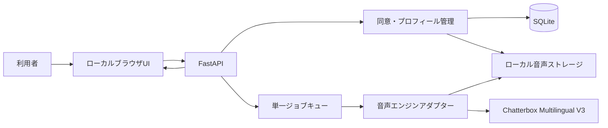

# koeclone システム仕様書

| 項目 | 内容 |
|---|---|
| 文書状態 | Draft 0.1（実装前レビュー待ち） |
| 作成日 | 2026-07-24 |
| 対象 | ローカル音声クローン・テキスト読み上げ・録音システム |
| 開発ディレクトリ | `/Users/Jobs1/AI/koeclone` |
| 想定利用者 | 自分自身の声を複製して利用する単一ユーザー |

## 1. 目的

利用者が自分の声をマイクで登録し、入力したテキストをその声で読み上げ、生成音声を再生・保存・ダウンロードできるローカルファーストのシステムを作る。

本システムの「声のクローン」は、参照音声から話者の特徴を条件付けして音声を生成するゼロショット音声合成を指す。本人の声以外を複製する用途、本人になりすます用途、認証突破や詐欺に使う用途は対象外とする。

## 2. 前提と判断

- 保存先の指定に `koeclone` と `koeclode` の表記揺れがあったが、既存の `/Users/Jobs1/AI/koeclone/docs` を正とする。
- MVPはmacOS上で動く単一ユーザー向けローカルWebアプリとする。
- MVPの対象言語は日本語とする。英語などの追加言語は将来拡張とする。
- 音声サンプルの登録方式は、ブラウザからの直接録音と、WAVまたはMP3ファイルのアップロードの2方式とする。
- クラウドへの音声送信、ユーザー登録、外部公開、共有URL発行は行わない。
- 実装前に対象Macで音声エンジンのPoCを行い、互換性・速度・音質が基準未達なら代替エンジンを選ぶ。

## 3. 開発体制

### 3.1 役割

| 役割 | 責務 |
|---|---|
| Claude（唯一の指揮官） | 要件確定、設計判断、タスク分解、専門家選定、依存導入、レビュー、検証、Git操作、ユーザー報告 |
| Codex（実装担当） | 指定ファイルのTDD実装、テスト作成・実行、実装結果とブロッカーの報告 |

### 3.2 開発規律

- Codexは `git add`、`commit`、`checkout`、`switch`、`merge`、`rebase`、`reset`、`stash`、worktree操作を実行しない。
- Claudeは各実装タスクに、目的、受入条件、変更可能ファイル、変更禁止ファイル、RED/GREEN/REFACTOR、検証コマンドを記載する。
- 同じファイルを変更するタスクは順次実行し、互いに素なファイル群だけを並行委譲する。
- ClaudeはCodexの自己申告だけで完了判定せず、差分・テスト・セキュリティ・生成物を独立確認する。
- BlockingまたはMajorのレビュー指摘が残る状態では次フェーズへ進まない。
- Git操作が必要な場合もClaudeが対象ファイルを個別にステージし、`git add .` と `git add -A` は使わない。

## 4. スコープ

### 4.1 MVPに含むもの

1. 初回利用時の利用規約・本人同意確認
2. 直接録音またはファイルアップロードの登録方式選択
3. 直接録音モードでの同意文・本人音声サンプルのライブ録音
4. ファイル登録モードでのWAVまたはMP3アップロード
5. 録音・アップロード音声の形式、長さ、音量、無音、破損の品質検査
6. 1件の音声プロフィールの作成・再録音・再アップロード・削除
7. 日本語テキストの入力と音声生成
8. 漢字を含む任意の部分へかな読みを指定する読み修正モード
9. 生成状態の表示
10. 生成音声のブラウザ再生
11. WAV形式での保存・ダウンロード
12. ローカル生成履歴の表示と個別削除
13. 音声プロフィール削除時の関連データ一括削除
14. AI生成情報を記載したサイドカーファイルの出力
15. 音声エンジン内蔵ウォーターマークの維持

### 4.2 MVPに含めないもの

- 他人、有名人、故人、キャラクターの声のクローン
- 複数ユーザー、ログイン、権限管理、クラウド同期
- 電話、リアルタイム通話、ライブボイスチェンジャー
- SNS投稿、外部共有、公開音声ライブラリ
- モデルの追加学習・ファインチューニング
- 感情・抑揚の高度編集、音声編集DAW機能
- MP3/AAC出力、バッチ生成、APIの外部公開
- 生成音声のウォーターマーク除去
- 自動読み推定、アクセント辞書編集、読み修正の全テキスト共通辞書

## 5. 主要ユースケース

### UC-01 音声プロフィールを作成する

1. 利用者が「自分自身の声だけを登録する」ことに同意する。
2. 利用者が「直接録音」または「WAV/MP3アップロード」を選択する。
3. 直接録音では、システムが都度生成した同意文を表示し、利用者が同意文と10〜60秒の日本語音声サンプルをマイクで録音する。
4. ファイル登録では、利用者が本人の声であることを再確認し、10〜180秒のWAVまたはMP3を選択する。
5. システムが実データ形式、デコード可否、長さ、音量、無音率、クリッピングを検査する。
6. 利用者が検査済み音声を試聴して登録を確定する。
7. システムが合格した音声を正規化し、音声プロフィールを作成する。

### UC-02 テキストを自分の声で読み上げる

1. 利用者が1〜1,000文字の日本語テキストを入力する。
2. 読み間違いを直す場合、利用者が「読み修正モード」を有効にする。
3. 利用者が漢字を含む対象部分を選択し、正しい読みをひらがなまたはカタカナで入力する。
4. システムが原文と修正後の合成用テキストを並べて表示し、修正部分を強調する。
5. 利用者が必要な箇所だけ修正を追加・編集・削除する。
6. 利用者が「AI生成音声として利用する」ことを確認する。
7. システムが原文を保持したまま、指定部分だけをかなに置換したテキストで生成ジョブを実行する。
8. 生成が完了すると音声プレイヤーを表示する。
9. 利用者が再生またはWAVファイルをダウンロードする。

### UC-03 データを削除する

1. 利用者が音声プロフィールまたは生成履歴を削除する。
2. システムが確認を表示する。
3. 確定後、対象の音声、メタデータ、派生ファイルをローカルから削除する。

## 6. 機能要件

### 6.1 同意と安全

| ID | 要件 |
|---|---|
| FR-001 | 初回利用前に、本人の声のみ登録可能であることと禁止用途を表示する。 |
| FR-002 | 同意チェックが完了するまで直接録音とファイルアップロードによるプロフィール登録を有効にしない。 |
| FR-003 | 直接録音モードでは、セッションごとに異なる同意文を提示してライブ録音する。 |
| FR-004 | ファイル登録モードでは、アップロード前と登録確定前に「自分自身の声であり、クローン作成の権利を持つ」ことを明示確認する。 |
| FR-005 | 同意記録を持たない音声プロフィールでは音声生成を拒否する。 |
| FR-006 | AI生成であることを示すウォーターマークを除去・無効化する設定を提供しない。 |
| FR-007 | 各生成音声に同名のJSONサイドカーを作り、`ai_generated=true`、生成日時、エンジン名、モデル版、音声ID、原文と合成用テキストのSHA-256、読み修正一覧を記録する。 |
| FR-008 | 生成直後にウォーターマークを検出し、検出できない音声は完成扱いにせず再生・ダウンロードを許可しない。 |
| FR-009 | 同意日時、同意方式、同意文、元音声のSHA-256、アプリバージョンを同意記録として保存する。直接録音時は同意録音のSHA-256も保存する。 |

### 6.2 音声登録と音声プロフィール

| ID | 要件 |
|---|---|
| FR-101 | プロフィール作成開始時に、直接録音またはWAV/MP3アップロードを選択できる。 |
| FR-102 | 直接録音モードではブラウザのマイク権限を要求し、録音開始、経過時間、停止、試聴、破棄、再録音を提供する。権限拒否時は復旧手順を表示する。 |
| FR-103 | 直接録音のサンプル長は10〜60秒とし、範囲外は登録を拒否する。 |
| FR-104 | ファイル登録モードではWAVまたはMP3を受け付ける。最大50MB、再生時間10〜180秒とし、範囲外はアップロード処理前またはデコード直後に拒否する。 |
| FR-105 | ファイル拡張子だけを信用せず、MIME情報、ファイルシグネチャ、実デコード結果を照合する。形式偽装、破損、暗号化、音声を含まないファイルを拒否する。 |
| FR-106 | 直接録音とアップロードの両方で、無音率80%以上、ピークが-1dBFSを超えるクリッピング、平均音量が基準外のサンプルを拒否し、理由を表示する。閾値はPoCで確定する。 |
| FR-107 | 合格した音声を単一話者、モノラル、24kHz以上のWAVへ正規化する。アップロード元ファイルから、無音と異常音を避けた10〜30秒の参照区間を抽出する。 |
| FR-108 | 登録確定前に正規化後の参照音声を試聴でき、利用者が破棄、再録音、別ファイル選択を実行できる。 |
| FR-109 | 音声プロフィールへ登録方式、元形式、元音声SHA-256、正規化済み参照音声SHA-256を保存する。 |
| FR-110 | MVPで保持できる有効な音声プロフィールは1件とする。 |
| FR-111 | プロフィール作成後にテスト文を生成し、利用者が声質を確認できる。 |
| FR-112 | プロフィール作成に成功したら、正規化済み参照音声と必要な同意記録だけを残し、処理用の録音元・アップロード元一時ファイルを削除する。 |
| FR-113 | 音声プロフィールを削除すると、正規化済み参照音声、同意録音、キャッシュ、関連生成音声をすべて削除する。 |

### 6.3 テキスト音声合成

| ID | 要件 |
|---|---|
| FR-201 | 1〜1,000文字のUTF-8日本語テキストを受け付ける。空白のみは拒否する。 |
| FR-202 | 制御文字、HTML、スクリプトを実行せず、単なる読み上げ対象文字列として扱う。 |
| FR-203 | 長文を句読点境界で分割し、順序を維持して合成・結合する。 |
| FR-204 | 同時に実行する生成ジョブは1件とし、後続はキューへ入れる。 |
| FR-205 | ジョブ状態を `queued`、`running`、`succeeded`、`failed` で返す。 |
| FR-206 | 失敗時は利用者向けメッセージと内部エラーIDを返し、部分音声を完成品として表示しない。 |
| FR-207 | 出力はモノラルWAVとし、サンプルレートは採用モデルの標準値を維持する。 |
| FR-208 | 生成後にブラウザ内再生、一時停止、シーク、音量変更を提供する。 |
| FR-209 | ダウンロード名は `koeclone_YYYYMMDD_HHMMSS_<short-id>.wav` とする。 |
| FR-210 | テキスト入力画面で「通常モード」と「読み修正モード」を切り替えられる。 |
| FR-211 | 読み修正モードでは、原文から漢字を1文字以上含む連続範囲を選択し、その範囲だけに読みを設定できる。 |
| FR-212 | 指定読みはひらがな、カタカナ、長音記号、中点、空白だけを許可し、空文字や漢字・英数字を含む読みを拒否する。 |
| FR-213 | 1つのテキストへ複数の読み修正を追加できる。修正範囲の重複、原文範囲外、元文字列不一致を拒否する。 |
| FR-214 | 読み修正は `surface`、`start`、`end`、`reading` で表す。`start` と `end` はUnicodeコードポイント単位の半開区間とし、サーバーは `text[start:end] == surface` を検証する。 |
| FR-215 | 修正部分を強調した原文、指定読み、合成用テキストのプレビューを表示し、各修正を追加・編集・削除できる。 |
| FR-216 | 合成用テキストは原文の後方の修正範囲から順に指定読みに置換して作成し、その後に長文分割を行う。原文自体は変更しない。 |
| FR-217 | 原文は最大1,000文字、読み置換後の合成用テキストは最大2,000文字とし、超過時は生成前に拒否する。 |
| FR-218 | 通常モードでは読み修正を適用せず、原文をそのまま合成用テキストとして使用する。 |

### 6.4 履歴

| ID | 要件 |
|---|---|
| FR-301 | 成功した生成結果を新しい順に一覧表示する。 |
| FR-302 | 履歴に生成日時、原文先頭80文字、読み修正件数、音声長、状態を表示する。 |
| FR-303 | 履歴から再生、WAVダウンロード、個別削除を実行できる。 |
| FR-304 | 保存テキストと生成音声はアプリ内操作で個別または全件削除できる。 |

## 7. 非機能要件

### 7.1 セキュリティとプライバシー

- サーバーは既定で `127.0.0.1` のみにバインドし、LANやインターネットへ公開しない。
- CORSは無効または同一オリジン限定とし、ワイルドカードを許可しない。
- 音声・テキスト・同意記録を外部サービスへ送信しない。
- 初回の依存関係・モデル取得完了後は、ネットワークを遮断しても登録・生成・再生・保存・削除ができる。
- データディレクトリの権限は所有ユーザーだけが読み書きできる状態にする。
- ファイル名にはユーザー入力を使わず、UUIDから生成してパストラバーサルを防ぐ。
- 録音・アップロードリクエストは最大50MB、テキストは最大1,000文字に制限する。
- アップロードファイルのパスや表示名をシェルコマンドへ連結せず、FFmpegは引数配列と固定オプションで実行する。
- ログに音声データ、全文テキスト、秘密情報を出力しない。
- モデル取得元、モデル版、ファイルハッシュを固定し、意図しない更新を防ぐ。
- 依存関係とモデルのライセンスをPoC時とリリース前に再確認する。
- 本システムだけで本人性を完全に証明できるとは主張しない。ライブ同意またはアップロード時の権利確認は抑止と監査証跡であり、なりすまし防止を保証するものではない。

### 7.2 性能

- 画面操作への応答は、生成処理を除き通常500ms以内を目標とする。
- ジョブ状態は1秒以内の間隔で更新できる。
- 10秒相当の日本語音声を、基準Macで60秒以内に生成できることを暫定合格基準とする。
- 初回モデルロード時間とピークメモリはPoCで測定し、実測値を `docs/poc-results.md` に記録する。
- 性能基準未達でもUIをブロックせず、キュー状態と進行中であることを表示する。

### 7.3 品質

- 20件の日本語評価文で、入力にない長い発話、無限反復、異常な末尾継続が0件であること。
- 20件の評価文の95%以上で、内容を人が正しく聞き取れること。
- 固有名詞・人名・地名を含む10件の評価文で、指定した部分読みが10件すべて意図どおり発音されること。
- 声の本人らしさについて、音声所有者が5段階中4以上と評価すること。
- 参照録音と同じ言語タグ `ja` を使用し、言語不一致によるアクセント劣化を避ける。
- 品質基準未達時は参照音声の再録音または別ファイルの選択を案内し、低品質なプロフィールを自動採用しない。

### 7.4 保守性

- 音声エンジンはアプリ本体からインターフェースで分離し、テストでは偽エンジンへ置換できること。
- ドメインロジック、HTTP層、ストレージ層、音声エンジン層を分離する。
- エンジンのモデルロードはプロセス内で1回とし、リクエストごとの再ロードを避ける。
- MPS初期化に失敗した場合は理由を記録し、設定で許可されているときだけCPUへフォールバックする。
- 全APIエラーは安定したエラーコードと利用者向けメッセージを持つ。

## 8. 技術構成

### 8.1 採用候補

| 領域 | MVP候補 | 理由 |
|---|---|---|
| 音声エンジン | Chatterbox Multilingual V3 | 日本語を含む23以上の言語、ゼロショット音声クローン、MITのコードリポジトリ、CPU/CUDA/MPS指定、PerThウォーターマーク |
| バックエンド | Python 3.11 + FastAPI | 音声モデルと同一言語で統合しやすく、APIとテストを分離しやすい |
| フロントエンド | サーバー配信のHTML/CSS/Vanilla JavaScript | 単一ユーザーMVPに必要な録音・再生機能を最小構成で実現できる |
| 音声変換 | FFmpeg | ブラウザ録音、WAV、MP3のデコード、モノラル化、正規化、参照区間抽出 |
| メタデータ | SQLite | ローカル単一ユーザーの履歴・同意記録に十分 |
| ファイル保存 | ローカルデータディレクトリ | 音声を外部へ送信せず、削除対象を明確化できる |
| テスト | pytest + FastAPI TestClient + Playwright | 単体・API統合・主要ブラウザフローを検証できる |

Chatterbox公式リポジトリは、Multilingual V3を推奨多言語モデルとして案内し、日本語、`cpu` / `cuda` / `mps`、音声プロンプトによるクローン、MITライセンス、生成音声へのPerThウォーターマークを明記している。ただし開発・検証環境はPython 3.11 / Debian 11が中心のため、macOS実機PoCを必須とする。コードのライセンスだけで採用判断せず、ダウンロードするモデル重みの利用・再配布条件も別途確認する。

参考:

- [Resemble AI Chatterbox公式リポジトリ](https://github.com/resemble-ai/chatterbox)
- [ElevenLabs Voice Cloning — 本人確認を含む安全設計の参考](https://elevenlabs.io/docs/eleven-api/concepts/voice-cloning)

### 8.2 論理構成



### 8.3 ディレクトリ案

```text
koeclone/
├── docs/
│   ├── system-specification.md
│   ├── poc-results.md
│   └── adr/
├── src/koeclone/
│   ├── api/
│   ├── domain/
│   ├── engines/
│   ├── storage/
│   ├── web/
│   └── worker/
├── tests/
│   ├── unit/
│   ├── integration/
│   └── e2e/
├── scripts/
└── pyproject.toml
```

## 9. API概要

| Method | Path | 用途 |
|---|---|---|
| `GET` | `/api/health` | アプリ・モデル準備状態の確認 |
| `GET` | `/api/consent/challenge` | ランダム同意文の取得 |
| `POST` | `/api/voices` | 登録方式、同意情報、直接録音またはWAV/MP3からプロフィール作成 |
| `GET` | `/api/voices/current` | 現在のプロフィール取得 |
| `DELETE` | `/api/voices/current` | プロフィールと関連データの削除 |
| `POST` | `/api/syntheses/preview` | 読み修正を検証し、合成用テキストのプレビューを返す |
| `POST` | `/api/syntheses` | テキスト音声生成ジョブの作成 |
| `GET` | `/api/syntheses/{id}` | ジョブ状態・結果メタデータ取得 |
| `GET` | `/api/syntheses/{id}/audio` | 生成WAV取得 |
| `GET` | `/api/syntheses` | 履歴一覧 |
| `DELETE` | `/api/syntheses/{id}` | 生成結果削除 |
| `DELETE` | `/api/syntheses` | 生成履歴全削除 |

外部公開用APIではないため、OpenAPI画面は開発環境だけで有効にする。

## 10. データモデル

### VoiceProfile

| フィールド | 型 | 内容 |
|---|---|---|
| `id` | UUID | 内部識別子 |
| `display_name` | string | 画面表示名 |
| `source_mode` | enum | `direct_recording` または `file_upload` |
| `source_format` | string | 録音コンテナ、WAV、MP3 |
| `source_sha256` | string | 元音声のハッシュ |
| `reference_path` | path | 正規化済み参照音声 |
| `reference_sha256` | string | 改ざん・重複確認用 |
| `consent_method` | enum | `live_challenge` または `upload_declaration` |
| `consent_text` | string | 直接録音時の同意文またはアップロード時の権利確認文 |
| `consent_audio_path` | path/null | 直接録音モードの同意録音 |
| `consent_audio_sha256` | string/null | 直接録音モードの同意録音ハッシュ |
| `created_at` | datetime | 作成日時 |
| `engine` | string | エンジン識別子 |
| `model_version` | string | モデル版 |

### SynthesisJob

| フィールド | 型 | 内容 |
|---|---|---|
| `id` | UUID | ジョブ識別子 |
| `voice_id` | UUID | 使用した音声プロフィール |
| `text` | string | 表示・履歴に保持する原文 |
| `text_sha256` | string | 原文の監査用ハッシュ |
| `synthesis_text` | string | 読み修正を適用した合成用テキスト |
| `synthesis_text_sha256` | string | 合成用テキストの監査用ハッシュ |
| `pronunciation_overrides` | JSON array | `surface`、`start`、`end`、`reading` の一覧 |
| `language` | string | MVPでは `ja` 固定 |
| `status` | enum | queued/running/succeeded/failed |
| `audio_path` | path/null | 成功時のWAV |
| `sidecar_path` | path/null | AI生成情報JSON |
| `duration_ms` | integer/null | 生成音声長 |
| `watermark_detected` | boolean/null | 生成直後の検出結果 |
| `error_code` | string/null | 失敗分類 |
| `created_at` | datetime | 作成日時 |
| `completed_at` | datetime/null | 完了日時 |

## 11. 受入条件

### AC-01 初回同意

- Given: 同意していない新規利用者
- When: 音声登録画面を開く
- Then: 規約と禁止用途が表示され、同意するまで直接録音もファイルアップロードも開始できない

### AC-02 音声プロフィール作成

- Given: 同意済みでマイクが利用可能
- When: 有効な同意文と10〜60秒の品質基準内サンプルを録音する
- Then: 音声プロフィールが1件作成され、テスト音声を生成・再生できる

### AC-03 ファイルからの音声プロフィール作成

- Given: 本人音声であることを明示確認済み
- When: 50MB以下かつ10〜180秒の有効なWAVまたはMP3をアップロードし、正規化後の音声を試聴して確定する
- Then: ファイル登録方式の音声プロフィールが1件作成され、テスト音声を生成・再生できる

### AC-04 不正な音声ソースの拒否

- Given: 録音またはアップロードが短すぎる、長すぎる、容量超過、形式偽装、破損、ほぼ無音、またはクリッピングしている
- When: プロフィール作成を要求する
- Then: プロフィールを作らず、再録音または別ファイルを選択する方法を具体的に表示する

### AC-05 音声生成

- Given: 有効な音声プロフィールがある
- When: 1〜1,000文字の日本語テキストを送信する
- Then: ジョブが作成され、成功後にWAVを再生・ダウンロードできる

### AC-06 部分読み修正

- Given: 原文「明日は日本橋へ行きます」の「日本橋」に読み「にほんばし」が設定されている
- When: 読み修正モードでプレビューして音声を生成する
- Then: 原文は変更されず、合成用テキストは「明日はにほんばしへ行きます」となり、指定部分だけが「にほんばし」と発音される

### AC-07 入力・読み修正制限

- Given: 空白のみ、原文1,001文字以上、合成用テキスト2,001文字以上、無効な読み、重複範囲、元文字列不一致、またはプロフィール未作成
- When: 音声生成を要求する
- Then: 音声エンジンを呼び出さず、安定したエラーコードを返す

### AC-08 AI生成表示

- Given: 音声生成が成功した
- When: 出力ファイルを確認する
- Then: エンジン内蔵ウォーターマークが検出され、対応するAI生成サイドカーJSONが存在する。検出失敗時は完成扱いにしない

### AC-09 完全削除

- Given: 音声プロフィールと関連生成物が存在する
- When: 利用者がプロフィール削除を確定する
- Then: 正規化済み参照音声、同意録音、処理中に残った一時ファイル、モデルキャッシュ内の話者情報、生成音声、DB行が削除され、APIから取得できない

### AC-10 ローカル限定

- Given: アプリが既定設定で起動している
- When: 待受アドレスとネットワーク通信を検査する
- Then: `127.0.0.1` のみで待受し、モデル初回取得を除いて音声・テキストを外部送信しない。モデル取得後はネットワーク遮断中でも主要操作が成功する

## 12. テスト方針

| 種別 | 主な対象 |
|---|---|
| Unit | 入力検証、読み修正範囲・重複検証、合成用テキスト変換、音声品質判定、ファイル形式照合、長文分割、状態遷移、削除対象計算、サイドカー生成 |
| Integration | SQLite、読み修正プレビューAPI、録音・WAV・MP3保存、FFmpeg変換、API、偽音声エンジンを使うジョブ実行 |
| Engine contract | Chatterboxアダプターの入出力、モデル版、ウォーターマーク無効化設定がないこと |
| E2E | 直接録音・WAV/MP3登録、通常生成、部分読み修正、再生、ダウンロード、削除 |
| Manual quality | 日本語20文の明瞭性、読み修正10文の発音、声の類似度、異常継続、処理時間、ピークメモリ |
| Security | localhost限定、CORS、サイズ制限、パストラバーサル、ログ漏えい、完全削除 |

テストでは実モデルを毎回ロードせず、通常CIは偽エンジンを使う。実モデル試験は明示的なマーカーを付け、対応マシンでのみ実行する。
実在する人物の音声を自動テストfixtureやGitリポジトリへ含めず、合成音またはテスト専用に作成した非個人音声を使う。

## 13. 実装フェーズと品質ゲート

### Phase 0: 技術PoC

- Chatterbox Multilingual V3を対象Macへ導入する。
- MPSとCPUで、日本語参照音声から5文以上を生成する。
- 速度、Real-Time Factor、ピークメモリ、音質、異常継続、ウォーターマーク検出、コードとモデル重みのライセンスを記録する。
- 合格時のみPhase 1へ進む。未達時はCoqui XTTS v2などの代替候補を同じ基準で比較する。

完了条件: `docs/poc-results.md` が作成され、採用エンジンのADRが承認されている。

### Phase 1: ドメイン・ストレージ

- TDDでデータモデル、入力検証、読み修正変換、品質判定、SQLite、ファイル削除を実装する。

完了条件: Unit/Integrationテストが全件成功し、削除漏れがない。

### Phase 2: 音声エンジン・ジョブ

- エンジンアダプター、読み修正適用、単一ジョブキュー、分割合成、WAV結合、サイドカーを実装する。

完了条件: 偽エンジン試験と実モデル契約試験が成功する。

### Phase 3: API・UI

- 同意、登録方式選択、直接録音、WAV/MP3アップロード、プロフィール、テキスト入力、読み修正モード、進行表示、再生、履歴、削除を実装する。

完了条件: API統合試験と主要E2Eが成功する。

### Phase 4: 安全性・品質検証

- セキュリティレビュー、依存監査、ローカル限定確認、音質評価、削除検証を行う。

完了条件: Blocking/Major指摘がなく、AC-01〜AC-10を満たす。

## 14. 主なリスク

| ID | リスク | 影響 | 対策 |
|---|---|---|---|
| R-01 | macOS/MPSで依存が動かない | 高 | Phase 0で最優先検証し、CPUまたは代替エンジンへ切替 |
| R-02 | 日本語の類似度・明瞭性が不足 | 高 | 録音ガイド、品質判定、複数候補の同一評価文比較 |
| R-03 | 入力外の発話や反復が生成される | 高 | 文字数・出力長上限、チャンク化、20文品質ゲート、異常時破棄 |
| R-04 | アップロード機能で他人の声が登録される | 高 | 本人限定規約、アップロード前後の権利確認、元音声ハッシュ、外部公開機能を作らない。本人確認を保証する機能ではないと明示 |
| R-05 | 生体情報に相当する音声が漏れる | 高 | localhost限定、外部送信なし、権限制限、ログ抑制、完全削除 |
| R-06 | モデルや依存のライセンス変更 | 中 | バージョン固定、PoC時とリリース前の再確認、ライセンス一覧保存 |
| R-07 | 大きなモデルで待ち時間が長い | 中 | 単一ロード、ジョブキュー、進行表示、PoC性能ゲート |
| R-08 | ウォーターマーク検出器の仕様変更 | 中 | モデル版固定、検出試験を実モデル品質ゲートへ追加 |
| R-09 | MPS演算の未対応や初期化失敗 | 高 | 実機PoC、明示設定時のみCPUフォールバック、原因の可視化 |
| R-10 | 原文編集後に読み修正範囲がずれ、別の文字を置換する | 高 | Unicodeコードポイント範囲と元文字列を同時検証し、不一致時は再設定を要求 |

## 15. 未決事項

実装開始前に利用者またはPhase 0の実測で次を確定する。

1. 基準Macの機種、メモリ容量、空きディスク容量
2. 生成音声の既定保存期間（現案は利用者が削除するまで）
3. 声の類似度と生成速度のどちらを優先するか
4. 将来、英語など多言語を有効にするか
5. WAV以外の出力形式が必要か
6. OSログイン以外のアプリ内ロックが必要か

## 16. 実装開始条件

- 本仕様書のMVP範囲、本人限定方針、保存方針が承認されている。
- Phase 0の基準Mac情報が確定している。
- ClaudeがPhase 0の実装契約と検証コマンドを作成している。
- Codexの書込範囲に `/Users/Jobs1/AI/koeclone` が含まれている。
- 既存ユーザー差分と変更予定ファイルが競合していない。
